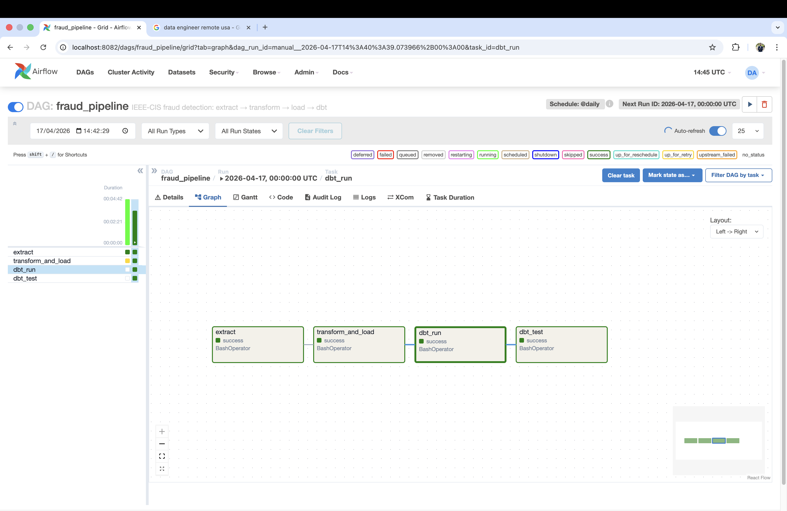
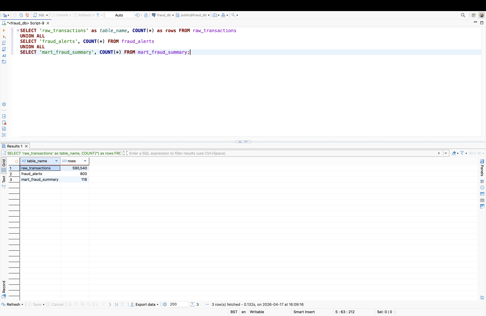
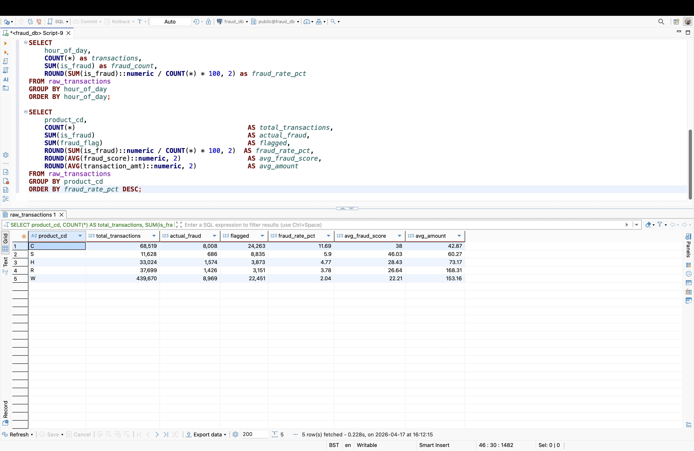
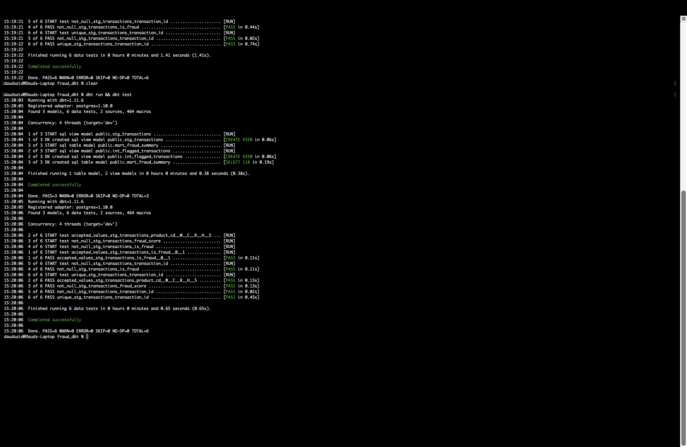
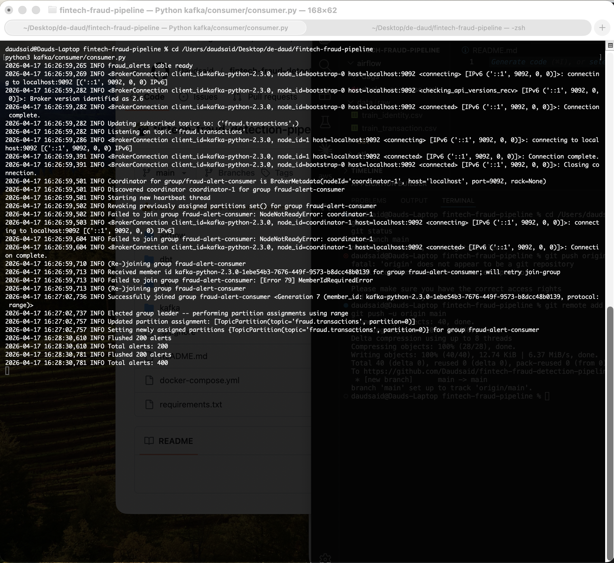

# Fintech Fraud Detection Pipeline

Production-grade data engineering pipeline for real-time transaction fraud detection. Ingests 590,540 IEEE-CIS transactions, applies feature engineering and rule-based scoring, streams flagged events through Apache Kafka, and serves analytics-ready models via dbt — orchestrated end-to-end with Apache Airflow.

---

## Architecture

```
┌─────────────────────────────────────────────────────────────────┐
│                        Data Sources                             │
│         IEEE-CIS train_transaction.csv + train_identity.csv     │
└──────────────────────────┬──────────────────────────────────────┘
                           │
                           ▼
┌─────────────────────────────────────────────────────────────────┐
│                      Python ETL Layer                           │
│   extract.py → transform.py → load_to_postgres.py              │
│   • Column selection (77 cols from 434)                         │
│   • Feature engineering (12 derived features)                   │
│   • Rule-based fraud scoring (0–100)                            │
│   • Chunked batch loading (10k rows/batch)                      │
└──────────────────────────┬──────────────────────────────────────┘
                           │
                           ▼
┌─────────────────────────────────────────────────────────────────┐
│                        PostgreSQL                               │
│   raw_transactions (590,540 rows)                               │
│   fraud_alerts (Kafka consumer output)                          │
└──────────┬──────────────────────────────┬───────────────────────┘
           │                              │
           ▼                              ▼
┌──────────────────────┐     ┌────────────────────────────────────┐
│    Apache Kafka      │     │              dbt                   │
│                      │     │                                    │
│  producer.py         │     │  stg_transactions (view)           │
│  → fraud.transactions│     │  int_flagged_transactions (view)   │
│  → consumer.py       │     │  mart_fraud_summary (table)        │
│  → fraud_alerts      │     │  6/6 tests passing                 │
└──────────────────────┘     └────────────────────────────────────┘
                           │
                           ▼
┌─────────────────────────────────────────────────────────────────┐
│                     Apache Airflow                              │
│   fraud_pipeline DAG — @daily                                   │
│   extract → transform_and_load → dbt_run → dbt_test            │
└─────────────────────────────────────────────────────────────────┘
```

---

## Tech Stack

| Layer | Technology | Version |
|---|---|---|
| Language | Python | 3.13 |
| Data Processing | Pandas, NumPy | 2.2, 1.26 |
| Storage | PostgreSQL | 15 |
| Streaming | Apache Kafka, Zookeeper | 7.6.0 |
| Transformation & Testing | dbt-postgres | 1.8 |
| Orchestration | Apache Airflow | 2.9.1 |
| Infrastructure | Docker, Docker Compose | - |
| Python Kafka Client | kafka-python | 2.0.2 |
| DB Connector | SQLAlchemy, psycopg2 | 2.0, 2.9 |

---

## Feature Engineering

| Feature | Description | Signal |
|---|---|---|
| amt_zscore | Standard score of transaction amount | Unusually large amounts |
| amt_log | Log-transformed amount | Normalises right skew |
| is_round_amount | Binary flag for whole-number amounts | Synthetic transaction indicator |
| is_high_value | Amount > $500 | High-risk threshold |
| card_velocity | Transaction count per card in dataset | Card abuse detection |
| p_email_risky | Purchaser email on common freemail domains | Identity thin-ness |
| email_match | Purchaser vs recipient email match | Account takeover signal |
| has_identity | Identity record present | Data completeness |
| is_mobile | Mobile device flag | Device risk signal |
| is_night | Transaction between 00:00–05:59 | Off-hours activity |
| is_weekend | Saturday or Sunday | Reduced monitoring window |
| v_null_density | Null rate across V1–V20 Vesta features | Thin/synthetic record |

---

## Fraud Score Formula

```
fraud_score = (
    amt_zscore.clip(0,5)     x 8   +
    is_night                 x 10  +
    is_weekend               x 5   +
    is_high_value            x 15  +
    is_high_fraud_product    x 20  +
    p_email_risky            x 5   +
    v_null_density           x 15  +
    (1 - email_match)        x 10
).clip(0, 100)

Threshold: fraud_flag = 1 if fraud_score >= 40
```

---

## dbt Layer

```
models/
├── staging/
│   ├── sources.yml                       # raw_transactions, fraud_alerts
│   ├── schema.yml                        # 6 data tests
│   └── stg_transactions.sql              # view — clean typed source
├── intermediate/
│   └── int_flagged_transactions.sql      # view — fraud_flag = 1
└── marts/
    └── mart_fraud_summary.sql            # table — fraud rates by segment
```

All models run in under 1 second. mart_fraud_summary produces 118 rows aggregated across product, card network, time-of-day, and value segments.

---

## Airflow DAG

```
fraud_pipeline (@daily)

[extract] ──→ [transform_and_load] ──→ [dbt_run] ──→ [dbt_test]

Operator:          BashOperator
Retries:           2 per task
Timeouts:          extract=15m, load=20m, dbt=10m
Zombie threshold:  600s
Catchup:           False
```

---

## Key Findings

| Segment | Fraud Rate | Notes |
|---|---|---|
| Product C — Visa | 13.2% | Highest volume fraud segment |
| Product C — Mastercard | 13.0% | Consistent with Visa |
| Product S — Discover | 17.8% | Small volume, high rate |
| Product W — all networks | 2.0% | Baseline — bulk of transactions |
| Night + High Value | >13% | Cross-segment elevated risk |
| Discover card overall | Elevated | Appears in 4 of top 10 fraud segments |

Overall fraud rate: **3.5%** (20,663 / 590,540 transactions)

---

## Proof

### Airflow — All 4 Tasks Green


### PostgreSQL — Table Row Counts


### Fraud Analysis by Product


### dbt Run and Test — PASS=6 WARN=0 ERROR=0


### Kafka — Producer and Consumer Live


---

## Setup

### Prerequisites
- Docker Desktop (6GB memory allocated)
- Python 3.13
- dbt-postgres

### Start Infrastructure

```bash
docker compose up -d
docker compose -f airflow/docker-compose.yml up -d
```

### Run ETL

```bash
python3 etl/load/load_to_postgres.py
```

### Stream via Kafka

```bash
# Terminal 1
python3 kafka/producer/producer.py --limit 50000

# Terminal 2
python3 kafka/consumer/consumer.py
```

### Run dbt

```bash
cd dbt/fraud_dbt
dbt run
dbt test
```

### Airflow UI

```
http://localhost:8082
Username: admin
Password: admin
```

---

## Dataset

[IEEE-CIS Fraud Detection — Kaggle](https://www.kaggle.com/c/ieee-fraud-detection)

590,540 transactions | 144,233 identity records | 3.5% fraud rate | 434 raw features